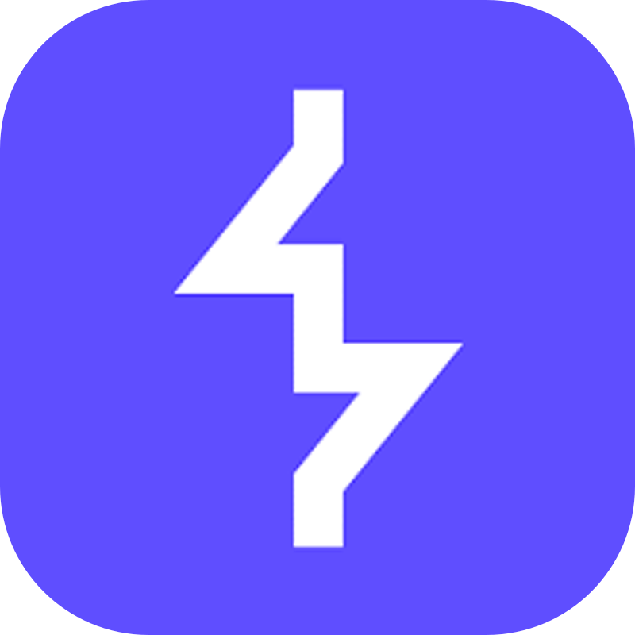
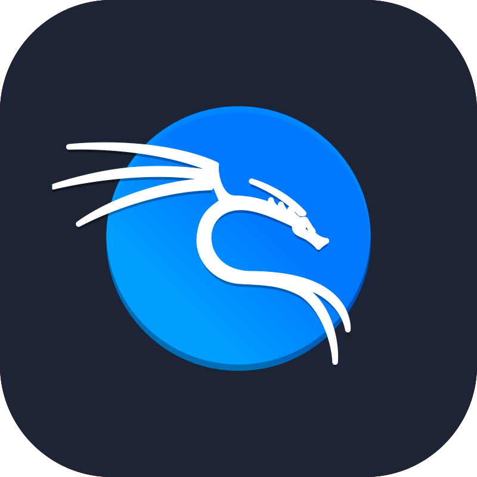
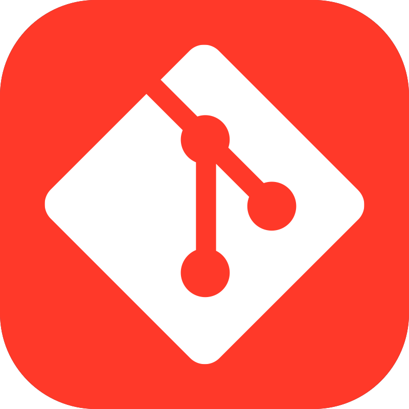
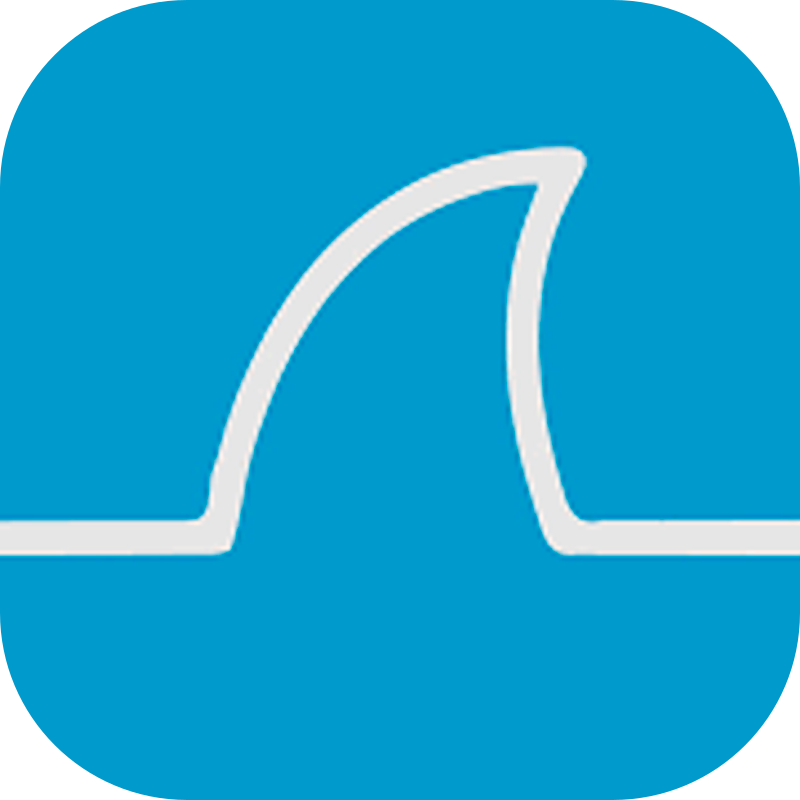
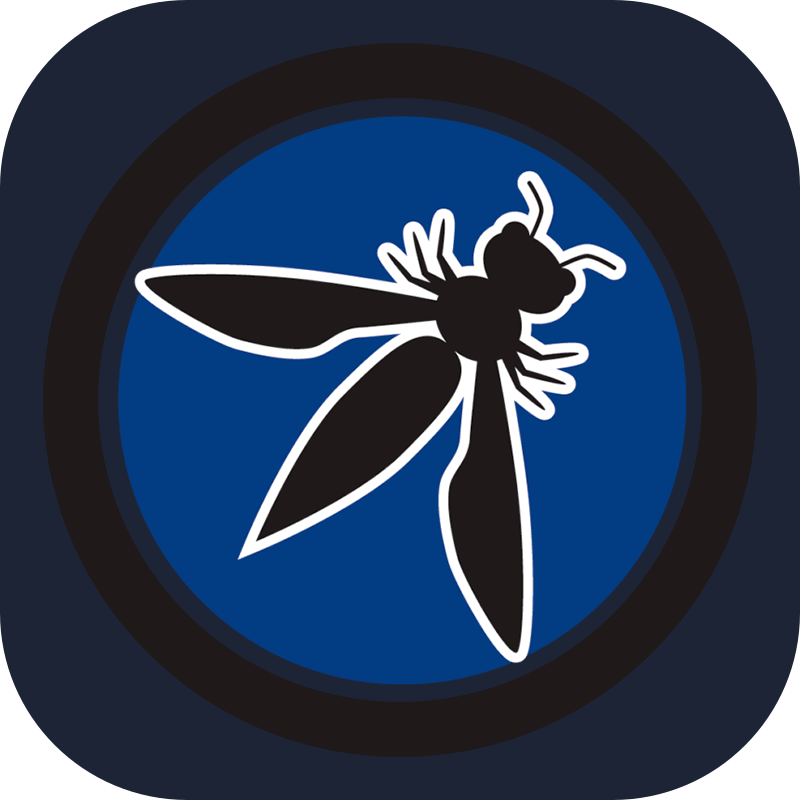

  <samp>
    <b>
      <code>サイバーセキュリティ</code>
    </b>
       
      <i> Hey! I'm Karina ^^ </i>
         
    ⊹₊˚‧︵‿₊୨ I'm Offensive Security Researcher & Creator Content݁ ୧₊‿︵‧˚₊⊹
  </samp>

##
 

  

  

##

  

   

##

 
 
  <table align="center">
  <tr>
    <td align="center" valign="middle">
      
    </td>
    <td align="center" valign="middle">
      
    </td>
    <td align="center" valign="middle">
      
    </td>
    <td align="center" valign="middle">
      
    </td>
    <td align="center" valign="middle">
     
    </td>
    <td align="center" valign="middle">
      
    </td>
    <td align="center" valign="middle">
      
    </td>
  </tr>
</table>
   
  <h3>30x Discovered CVEs:</h3>
  <a href="https://www.cve.org/CVERecord?id=CVE-2025-8538" target="_blank">CVE-2025-8538</a>,
  <a href="https://www.cve.org/CVERecord?id=CVE-2025-8539" target="_blank">CVE-2025-8539</a>,
  <a href="https://www.cve.org/CVERecord?id=CVE-2025-8540" target="_blank">CVE-2025-8540</a>,
  <a href="https://www.cve.org/CVERecord?id=CVE-2025-8541" target="_blank">CVE-2025-8541</a>,
  <a href="https://www.cve.org/CVERecord?id=CVE-2025-8542" target="_blank">CVE-2025-8542</a>,
  <a href="https://www.cve.org/CVERecord?id=CVE-2025-8543" target="_blank">CVE-2025-8543</a>, 
  <a href="https://www.cve.org/CVERecord?id=CVE-2025-8544" target="_blank">CVE-2025-8544</a>,
  <a href="https://www.cve.org/CVERecord?id=CVE-2025-8545" target="_blank">CVE-2025-8545</a>,
  <a href="https://www.cve.org/CVERecord?id=CVE-2025-9137" target="_blank">CVE-2025-9137</a>,
  <a href="https://www.cve.org/CVERecord?id=CVE-2025-9138" target="_blank">CVE-2025-9138</a>,
  <a href="https://www.cve.org/CVERecord?id=CVE-2025-9143" target="_blank">CVE-2025-9143</a>,
  <a href="https://www.cve.org/CVERecord?id=CVE-2025-9144" target="_blank">CVE-2025-9144</a>, 
  <a href="https://www.cve.org/CVERecord?id=CVE-2025-9145" target="_blank">CVE-2025-9145</a>,
  <a href="https://www.cve.org/CVERecord?id=CVE-2025-9531" target="_blank">CVE-2025-9531</a>,
  <a href="https://www.cve.org/CVERecord?id=CVE-2025-9532" target="_blank">CVE-2025-9532</a>,
  <a href="https://www.cve.org/CVERecord?id=CVE-2025-9652" target="_blank">CVE-2025-9652</a>,
  <a href="https://www.cve.org/CVERecord?id=CVE-2025-9653" target="_blank">CVE-2025-9653</a>,
  <a href="https://www.cve.org/CVERecord?id=CVE-2025-9720" target="_blank">CVE-2025-9720</a>, 
  <a href="https://www.cve.org/CVERecord?id=CVE-2025-9721" target="_blank">CVE-2025-9721</a>,
  <a href="https://www.cve.org/CVERecord?id=CVE-2025-9722" target="_blank">CVE-2025-9722</a>,
  <a href="https://www.cve.org/CVERecord?id=CVE-2025-9723" target="_blank">CVE-2025-9723</a>,
  <a href="https://www.cve.org/CVERecord?id=CVE-2025-9724" target="_blank">CVE-2025-9724</a>,
  <a href="https://www.cve.org/CVERecord?id=CVE-2025-9738" target="_blank">CVE-2025-9738</a>,
  <a href="https://www.cve.org/CVERecord?id=CVE-2025-10372" target="_blank">CVE-2025-10372</a>, 
  <a href="https://www.cve.org/CVERecord?id=CVE-2025-10373" target="_blank">CVE-2025-10373</a>,
  <a href="https://www.cve.org/CVERecord?id=CVE-2025-10584" target="_blank">CVE-2025-10584</a>,
  <a href="https://www.cve.org/CVERecord?id=CVE-2025-10844" target="_blank">CVE-2025-10844</a>,
  <a href="https://www.cve.org/CVERecord?id=CVE-2025-10845" target="_blank">CVE-2025-10845</a>,
  <a href="https://www.cve.org/CVERecord?id=CVE-2025-10846" target="_blank">CVE-2025-10846</a>,
  <a href="https://www.cve.org/CVERecord?id=CVE-2025-10909" target="_blank">CVE-2025-10909</a>
   
   
   <table>
  <tr>
    <td></td>
    <td></td>
    <td></td>
  </tr>
  <tr>
    <td align="center">24x CVEs</td>
    <td align="center">5x CVEs</td>
    <td align="center">1x CVE</td>
  </tr>
</table>
  

  
  
   
   

  _“Security is not a product, but a process.” – Bruce Schneier_

  

  &nbsp;
  &nbsp;
  &nbsp;
  &nbsp;
  &nbsp;
  &nbsp;
  &nbsp;
  &nbsp;
  &nbsp;
  &nbsp;
  &nbsp;
  &nbsp;
  &nbsp;
  &nbsp;
  

  ##

  *Made with💜 by Karina.* 

♡ 

 ♡

*Official Member of [CVE-Hunters](https://www.cvehunters.com/)🏹*
   

